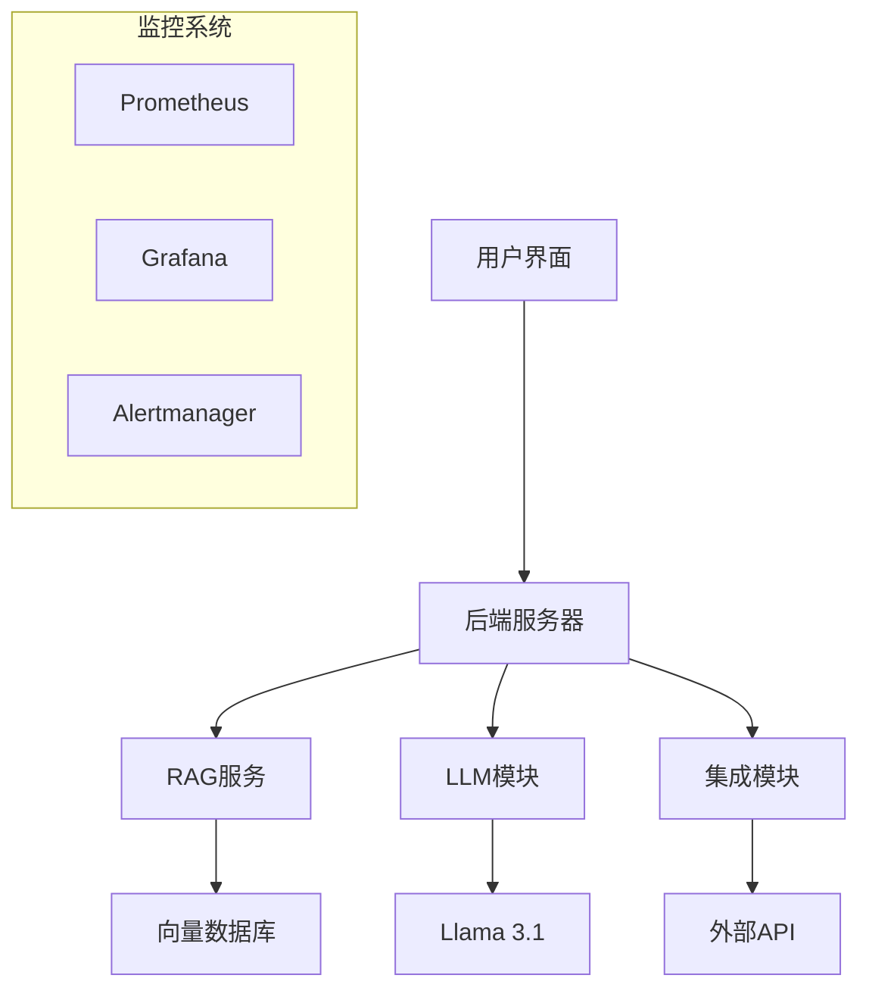

# Braindler - 互联网连接的个人AI助手


**面向现实世界任务、目标达成和人际沟通的智能AI助手**

[](https://github.com/braindler/Braindler)
[](https://discord.gg/UcZra8Ay)
[](LICENSE)
[](#)

</div>

## 🌟 项目概述

Braindler是新一代AI助手，具备互联网接入能力，专为完成现实世界任务、实现目标和增强人际沟通而设计。通过模块化架构和先进的RAG（检索增强生成）技术，Braindler能够自主分解复杂任务，利用互联网资源，并与多种平台无缝集成。

### 🎯 核心特性

#### 💡 智能任务处理
- **🧠 递归任务分解**: 将复杂目标分解为可执行的子任务
- **🔍 深度优先搜索**: 深入探索解决方案路径
- **🌐 广度优先搜索**: 全面评估多种可能性
- **🎯 动态目标管理**: 实时调整任务和目标

#### 🌐 互联网集成能力
- **⚡ 主动网络交互**: 自主与在线资源和服务交互
- **🔍 智能信息收集**: 从网站和数据库提取相关信息
- **📊 实时数据处理**: 获取最新、准确的数据资源
- **🤖 自动化操作**: 填写表单、发送消息、API调用

#### 👥 多用户协作
- **🤝 团队管理**: 支持多用户模式和群组协作
- **🎭 虚拟AI团队**: 创建专业化的AI团队成员
- **💬 无缝沟通**: 与个人和群组的自然交互
- **📈 进度监控**: 任务分配和进度跟踪

## 🏗️ 技术架构

### 🔧 核心组件



#### 🎛️ 用户界面层
- **📱 Telegram Bot**: 主要交互界面
- **🌐 Web界面**: 浏览器版本
- **📱 多平台支持**: LINE、WhatsApp、WeChat等

#### 🔄 后端服务器
- **🚀 FastAPI/Flask**: 中央编排器
- **📨 请求处理**: 消息接收和响应生成
- **🧭 任务路由**: 智能分类和处理逻辑
- **📊 性能监控**: 全面的日志和指标收集

#### 🔍 RAG服务模块
- **📚 知识存储**: FAISS/Milvus/Pinecone向量数据库
- **🧮 嵌入模型**: SentenceTransformers文本向量化
- **🎯 智能检索**: 最近邻搜索和相关性排序
- **🔄 知识更新**: 动态索引和数据库维护

#### 🤖 LLM模块
- **🦙 Llama 3.1**: 本地部署的大语言模型
- **⚡ GPU加速**: 快速推理和响应
- **🌊 流式输出**: 提升用户体验
- **⚙️ 参数配置**: 可调节的生成参数

### 📊 监控与质量保证

#### 🔍 性能监控
- **📈 响应时间监控**: Bot、后端、RAG、LLM各环节延迟
- **💻 资源使用监控**: GPU、CPU、内存、磁盘使用情况
- **🛡️ 服务稳定性**: 健康检查、错误率、重启监控
- **📊 业务指标**: 活跃用户、请求量、转化率

#### 🎯 质量指标
- **Precision@K > 0.8**: 检索结果相关性
- **Recall > 0.9**: 相关文档召回率
- **RAG利用率 > 70%**: 知识库使用频率
- **用户满意度 > 4/5**: 整体用户体验评分

## 🚀 功能特性

### 🎯 核心功能

#### 🧠 智能处理
- **🔄 循环机制**: 高效执行重复任务
- **📝 记忆管理**: 短期和长期记忆有效处理
- **🔐 安全存储**: 敏感信息如登录凭据的安全存储
- **🎨 个性化定制**: 多种人格类型和技能配置

#### 🌟 高级功能
- **🔊 语音合成**: 文本转语音输出
- **🎤 语音识别**: 语音转文本输入
- **🔌 插件系统**: 可扩展的自定义插件架构
- **🌍 多语言支持**: 支持多种语言交互

### 🔗 平台集成

#### 💼 企业集成
- **🖥️ 本地/远程计算机管理**: SSH远程控制
- **🐙 GitHub集成**: 代码管理和版本控制
- **📊 项目管理**: 任务分配和进度跟踪
- **📈 数据分析**: 数据洞察和可视化

#### 📱 通讯平台
- **💬 即时消息**: Telegram、LINE、WhatsApp、WeChat
- **🌐 社交媒体**: 自动化内容创建和发布
- **📧 邮件集成**: 自动化邮件处理和响应

## 📚 应用场景

### 🎓 教育领域
- **📖 作业辅导**: 多学科指导和解题步骤
- **📝 论文写作**: 头脑风暴、写作和编辑支持
- **🔬 研究助手**: 学术资源搜索和整理

### 💼 商务应用
- **📈 项目管理**: 任务管理、截止日期设置、进度监控
- **📊 数据分析**: 数据洞察生成和可视化创建
- **🤝 网络建设**: 潜在合作伙伴搜索和联系建立

### 👨�💻 开发支持
- **💻 代码开发**: 编写、调试、测试和编辑代码
- **📚 API文档**: API理解和使用指导
- **🚀 性能优化**: 代码和系统性能优化建议

### 🎨 创意设计
- **💡 创意生成**: 项目、设计、活动创意生成
- **🖼️ 视觉设计**: 设计元素、色彩搭配、布局指导
- **✍️ 文案创作**: 广告、社交媒体等营销文案

### 🛍️ 电商支持
- **📈 市场研究**: 竞争分析、客户调研
- **🛒 电商支持**: 产品推荐、订单处理、客户服务
- **📊 流量生成**: 网站和社交媒体流量提升

### 🤖 自动化应用
- **🔄 RPA**: 重复性任务自动化
- **🌐 网页抓取**: 数据提取和分析
- **📂 文件管理**: 文件组织、存储、检索

## 🛠️ 安装与配置

### 📋 系统要求

```bash
# 最低系统要求
- Python 3.8+
- CUDA支持的GPU (推荐)
- 8GB+ RAM
- 50GB+ 存储空间
```

### 🚀 快速开始

```bash
# 克隆仓库
git clone https://github.com/braindler/Braindler.git
cd Braindler

# 安装依赖
pip install -r requirements.txt

# 配置环境变量
cp .env.example .env
# 编辑 .env 文件配置API密钥

# 启动服务
python main.py
```

### ⚙️ 配置说明

```yaml
# config.yaml 示例
database:
  vector_db: "faiss"  # 或 "milvus", "pinecone"
  relational_db: "postgresql"

llm:
  model: "llama-3.1"
  max_tokens: 4096
  temperature: 0.7

monitoring:
  prometheus_port: 9090
  grafana_port: 3000
```

## 🤝 社区与贡献

### 👥 加入我们

我们热烈欢迎来自不同背景和技能水平的贡献者！

#### 🎯 贡献领域
- **🚀 命令扩展**: 开发新功能和命令
- **🎨 前端开发**: 用户界面和体验优化
- **🤖 后端开发**: 性能、稳定性、可扩展性
- **🧠 AI研究**: 模型优化和NLP技术研究
- **🌐 API集成**: 平台和服务集成
- **📝 文档编写**: 用户指南和开发文档
- **📢 市场推广**: 社区推广和内容创作
- **🌍 本地化**: 多语言翻译和本地化
- **🔧 质量保证**: 测试和错误修复

### 💬 联系方式

- **Discord服务器**: [加入讨论](https://discord.gg/UcZra8Ay)
- **GitHub Issues**: [问题反馈](https://github.com/braindler/Braindler/issues)
- **Telegram Bot**: [@Braindler_bot](https://t.me/Braindler_bot)

## 📈 发展路线图

### 🎯 版本1.0目标
- ✅ 核心RAG架构实现
- ✅ Telegram Bot集成
- ✅ 基础监控系统
- 🔄 多语言支持优化
- 🔄 插件系统完善

### 🚀 未来计划
- **🧠 模型优化**: 中文数据集微调
- **🔐 安全增强**: 私有部署选项
- **📱 移动应用**: 原生移动客户端
- **🌐 浏览器扩展**: Chrome/Firefox插件
- **🏢 企业版本**: 高级功能和支持

## 📄 许可证

本项目基于 MIT 许可证开源 - 查看 [LICENSE](LICENSE) 文件了解详情。

## 🙏 致谢

感谢所有为Braindler项目做出贡献的开发者、研究人员和社区成员！

---

<div align="center">

**⭐ 如果这个项目对你有帮助，请给我们一个星标！⭐**

[主页](https://github.com/braindler/Braindler) | [文档](https://docs.braindler.com) | [Discord](https://discord.gg/UcZra8Ay) | [Blog](https://blog.braindler.com)
